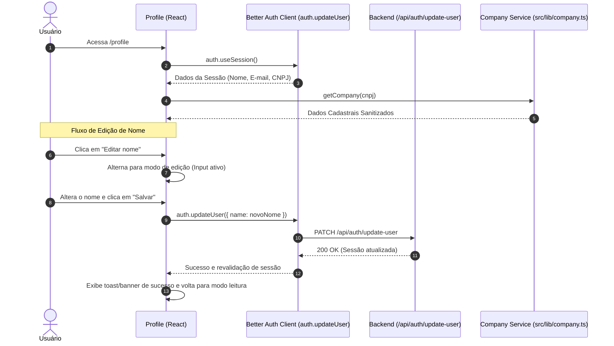

# Plano de Modernização da Página de Perfil

Este documento detalha o plano de reformulação da página de perfil do usuário ([`src/pages/Profile.tsx`](file:///home/vitor/Projetos/agendei-frontend/src/pages/Profile.tsx)) no projeto [`agendei-frontend`](file:///home/vitor/Projetos/agendei-frontend), abrangendo a nova identidade visual profissional, a remoção completa de referências ao OpenCNPJ e a implementação da funcionalidade de edição do nome cadastrado.

---

## 1. Objetivos

1. **Interface Profissional e Sofisticada:**
   - Redesenhar a tela de perfil utilizando a paleta de cores e o padrão visual do Agendei.
   - Incluir cabeçalho corporativo com avatar dinâmico (iniciais do usuário), nome, e-mail e indicador de "Conta Ativa".
   - Estruturar as informações em cards bem delineados, com sombras suaves, espaçamentos consistentes e ícones temáticos do `@tabler/icons-react`.

2. **Remoção de Identificação Externa (OpenCNPJ):**
   - Retirar o rodapé com link para `https://opencnpj.org/` na página [`src/pages/Profile.tsx`](file:///home/vitor/Projetos/agendei-frontend/src/pages/Profile.tsx).
   - Sanitizar as mensagens de erro em [`src/lib/company.ts`](file:///home/vitor/Projetos/agendei-frontend/src/lib/company.ts) para remover menções a "OpenCNPJ", tornando a comunicação neutra e institucional ("Dados cadastrais não encontrados", etc.).

3. **Edição do Nome do Usuário:**
   - Adicionar modo de edição inline/formulário para o campo **Nome**.
   - Integrar com o método `auth.updateUser({ name })` da biblioteca `better-auth/react`.
   - Incluir validação (mínimo de 2 caracteres), tratamento de estados (carregando, sucesso, erro) e sincronização imediata da sessão na interface e na barra lateral ([`Sidebar.tsx`](file:///home/vitor/Projetos/agendei-frontend/src/components/Sidebar.tsx)).

---

## 2. Arquitetura e Fluxo de Dados



---

## 3. Especificação das Modificações

### 3.1. Utilitário de Consulta de Empresa (`src/lib/company.ts`)

#### [MODIFY] [`src/lib/company.ts`](file:///home/vitor/Projetos/agendei-frontend/src/lib/company.ts)
- Ajustar mensagens de erro para que sejam neutras e institucionais:
  - `"Empresa não encontrada no OpenCNPJ."` ➔ `"Dados cadastrais não encontrados para este CNPJ."`
  - `"A consulta ao OpenCNPJ está indisponível..."` ➔ `"A consulta de dados cadastrais está temporariamente indisponível."`
  - `"Não foi possível consultar o OpenCNPJ..."` ➔ `"Não foi possível consultar os dados cadastrais da empresa."`

---

### 3.2. Página de Perfil (`src/pages/Profile.tsx`)

#### [MODIFY] [`src/pages/Profile.tsx`](file:///home/vitor/Projetos/agendei-frontend/src/pages/Profile.tsx)
- **Estrutura Visual:**
  - **Cabeçalho:**
    - Card com avatar circular contendo as iniciais do usuário.
    - Nome em destaque, e-mail da conta e badge de "Conta Ativa" com ícone de verificação.
  - **Card de Dados Pessoais e Acesso:**
    - **Nome:** Exibição com botão "Editar nome" (`IconEdit`). Em modo de edição, exibe input com botões "Salvar" (`IconCheck`) e "Cancelar" (`IconX`).
    - **E-mail:** Campo de leitura protegida com ícone de segurança.
    - **CNPJ:** Formatado com máscara legível (`XX.XXX.XXX/XXXX-XX`) e ícone indicativo.
    - **Feedback:** Alerta de sucesso quando o nome for atualizado com sucesso.
  - **Card de Dados Cadastrais da Empresa:**
    - Grid organizado com Razão Social, Nome Fantasia, Endereço Completo, CEP, Município/UF e Atividade Principal (CNAE).
    - Remoção definitiva da linha `Dados consultados no OpenCNPJ`.
    - Loading e tratamento de erros discretos com botão de tentar novamente (`ApiFeedback`).

---

### 3.3. Estilização do Perfil (`src/pages/Profile.module.css`)

#### [NEW / MODIFY] [`src/pages/Profile.module.css`](file:///home/vitor/Projetos/agendei-frontend/src/pages/Profile.module.css)
- Implementar classes modulares profissionais:
  - `.profileHeader`: Card de destaque com gradiente suave e avatar estilizado.
  - `.avatarBadge`: Avatar com iniciais, borda refinada e sombra.
  - `.card`: Cartão branco com bordas arredondadas e divisores sutis.
  - `.field`: Container de campo com label claro e input elegante.
  - `.editActions`: Botões estilizados para Salvar (primário), Cancelar (secundário) e Editar.
  - `.badgeActive`: Tag com fundo verde claro e texto em tom de sucesso para "Conta Ativa".
  - `.successBanner`: Notificação visual de sucesso após salvar o nome.
  - Responsividade completa para dispositivos móveis (< 600px).

---

## 4. Roteiro de Verificação

### Testes Automatizados
```bash
# No diretório agendei-frontend
pnpm exec tsc -b
pnpm lint
pnpm format
```

### Validação Manual
1. **Visualização Inicial:** Acessar `/profile` e validar se o cabeçalho exibe o avatar com as iniciais do usuário, nome, e-mail e badge "Conta Ativa".
2. **Edição do Nome:**
   - Clicar em "Editar nome".
   - Digitar novo nome válido e clicar em "Salvar".
   - Validar feedback visual de salvamento e confirmação.
   - Conferir se o novo nome reflete imediatamente na página e no menu lateral (`Sidebar`).
3. **Ausência de OpenCNPJ:** Inspecionar visualmente se nenhuma menção a "OpenCNPJ" ou link externo aparece na página.
